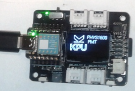

# XIAO SAMD21 Load Image from MicroSD

**xiao_kpu.ino** was modified from an example in the [U8g2](https://github.com/olikraus/U8g2_Arduino) library. It is a general 
monochrome graphics library. The example used as the model for this modified application **LoadFromSD.ino** had many lines of code not needed for 
the Seeed XIAO board so the modified example is significantly simplified.

* The microcontroller board [Seeed XIAO SAMD21](https://www.seeedstudio.com/Seeeduino-XIAO-Arduino-Microcontroller-SAMD21-Cortex-M0+-p-4426.html)
* The [expansion board](https://wiki.seeedstudio.com/Seeeduino-XIAO-Expansion-Board/)
* [U8g2 library](https://github.com/olikraus/U8g2_Arduino)
    * [external conversion tool](https://github.com/olikraus/u8g2/tree/master/tools/png2bin), which generates the expected binary from a PNG file.
* 3D printable [expansion board base](https://www.printables.com/model/281276-seeed-xiao-expansion-board-base-caver/files)

 

Image used as a PNG before converting to bin.

